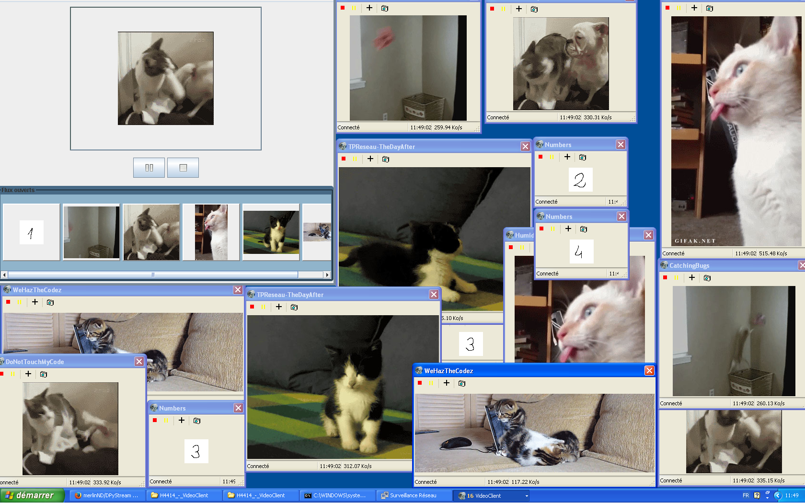

DPyStream
=========

DPyStream is a tiny video streaming application allowing multiple protocols.

## Supported protocols

* TCP (Push)
* TCP (Pull)
* UDP (Push)
* UDP (Pull)
* MultiCast (Push)

## Resource management

All videos that are sent are described in the catalog folder. To add (or change) a video, you need to:

1. Add the files in the `resources/` folder
2. Describe your video in a text file in the `catalog/` folder
3. Add the path of your file to `catalog/startup.txt`

## How to run this app

You will need to have python *3.0* (or higher) installed to execute our application. See [python's site](http://www.python.org/) for help with that.

1. Install python (say, at `path/to/python`)
2. Change your directory to the root folder: `cd path/to/DPyStream/`
3. Add the resources you want (and change the catalog accordingly)
4. Execute the main file: `path/to/python DPyStream.py`
5. The server is now running.
6. To shutdown the server, at any time, just press `Enter`